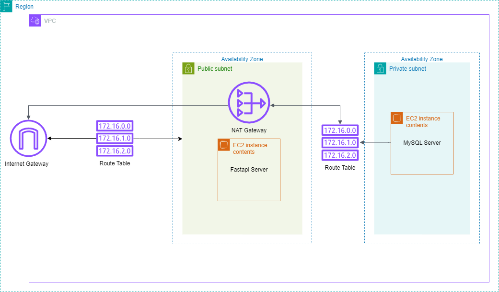

# <p align="center">WCD Project 2 - Infrastructure-as-Code </p>

**URL:** [WCD Project 2 (Terraform)](https://github.com/RakinKhan/WCD-Project-2)
<br/>
**Group Members:** Lara, Farius, Juan, Rakin

## Architecture


## Setup Instructions
The following files sets up a multi-tiered application infrastructure using Terraform. Using this configuration, a VPC (Virtual Public Cloud) is created in AWS with a public and private subnet. The public subnet host's an EC2 Instance for a Fastapi Server and a NAT Gateway, and is connected to an Internet Gateway for public access. The private subnet hosts an EC2 Instance containing a MySQL database server. The MySQL server instance is connected to the NAT Gateway in the public subnet through a separate routing table. The reason for the addition of the NAT Gateway though not mentioned in the project requirements, is that in order to run the bash shell commands to update Ubuntu packages and install/run the MySQL server, the instance needs to access the public internet while not being publically accessable. 

The following steps require an access key and secret key credentials from AWS, a public and private ssh key pair, and Terraform installed. **NOTE** A .pem key generated by AWS can be used instead to ssh into your subnet. In order to use the .pem key, place the key in your a .ssh folder and change the file path in the aws_key_pair resource in the main.tf file.

1. Download the project from Github and in the Terminal, change the path to the directory of the project folder.
2. In the access-credentials.tf file replace the empty string values of the access key and private key with yours. 
3. In the main.tf file, make sure that the path to your public key in the resource block aws_key_pair matches the actual location.
4. Run the following code in the terminal, in order:
```
terraform init
# Initializes working directory containing Terraform files.

terraform plan
# Creates and execution plan and preview changes.

terraform apply -auto-approve
# Applies the configuration made in the Terraform files
```
5. Once the configuration is completed, you can ssh into your public subnet using your public key and public ip. To confirm that Python and FastAPI type in the instance terminal:
```
python3 --version
# Checks version of Python installed.

pip list
# Checks python packages installed.
```
6. Once you confirm that the installation was completed, ssh into your private subnet by creating a copy of your public key.
7. Inside the private subnet, run the following commands to confirm that the MySQL was installed and running, as well as port 3306 was opened:
```
sudo systemctl status mysql
# Checks status of MySQL server. 

sudo ss -tulpn
# Lists open ports. check for port 3306.
```
8. Once completed, exit out both the private and public instances, and return to the project directory in the Terminal. To shut down the infrastructure created for the project, run the following commands:
```
terraform destroy -auto-approve
# Destroys all resources created by the infrastructure.
```